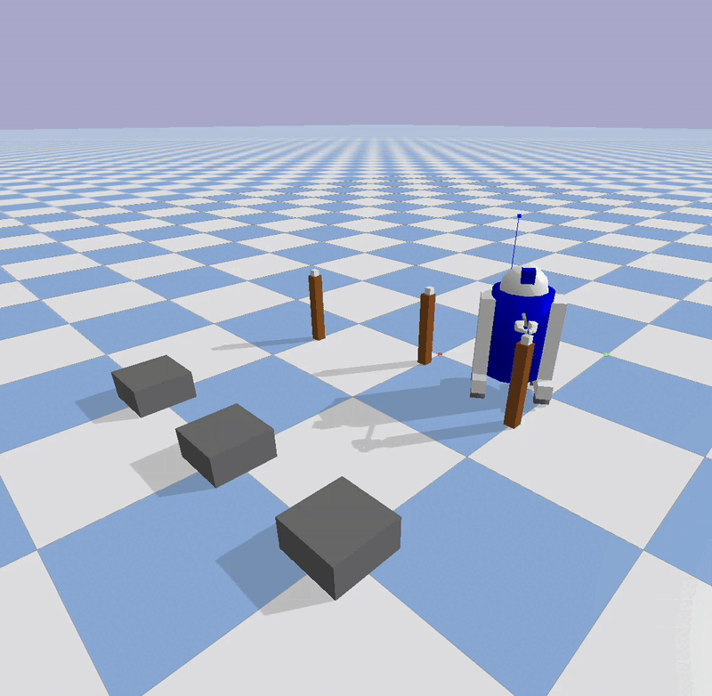

# Humanoid Skill Sim

A Python project I built to explore humanoid robotics with behavior trees and skill development related to my interest in robotics, AI, and autonomous systems.



*Note: The GIF compression makes the visualization appear choppy - the actual simulation runs much smoother when viewed live or in PyBullet.*

## What it does

- Simulates a humanoid robot performing complex manipulation tasks
- Each task is controlled by behavior trees (hierarchical AI logic)
- Robot can walk, pick up objects, place them, and navigate around obstacles
- Supports different workflow configurations (simple walk, fetch-and-place, delivery routes)
- Built-in collision avoidance and path planning using physics simulation
- Tweakable settings for robot parameters, world setup, and task complexity

## Project structure

```
humanoid-skill-sim/
├── sim/
│   ├── robot.py               # humanoid robot simulation + movement
│   ├── world.py              # physics world setup with objects
│   └── teleop_override.py    # manual control override system
├── behavior_tree/
│   ├── node.py               # base behavior tree node classes
│   ├── sequence.py           # sequential task execution
│   ├── fallback.py           # backup behavior handling
│   └── action_nodes.py       # actual robot actions (walk, pick, place)
├── skills/
│   ├── walk.py               # walking and navigation logic
│   ├── pick.py               # object grasping and manipulation
│   ├── place.py              # object placement logic
│   └── custom_workflow.py    # complex composed behaviors
├── configs/
│   └── workflows.yaml        # different task configurations
├── tests/                    # various testing scripts
├── logs/                     # simulation run data and logs
├── assets/                   # demo gifs and media
├── run_sim.py               # main simulation runner
└── README.md                # you are here
```

## Building and Running

```bash
# install dependencies
pip install -r requirements.txt

# run a simple walking test
python run_sim.py --workflow simple_walk

# run fetch and place task (more complex)
python run_sim.py --workflow fetch_and_place

# run with visualization (opens PyBullet GUI)
python run_sim.py --workflow delivery_workflow --gui

# export logs for analysis
python run_sim.py --workflow simple_walk --export-logs
```

For debugging or development:
```bash
# run with detailed logging
python run_sim.py --workflow fetch_and_place --verbose

# run without physics GUI (faster)
python run_sim.py --workflow simple_walk --no-gui

# run interactive mode for testing
python run_interactive.py
```

## How to use it

The robot shows up as a humanoid figure, objects are colored boxes/shapes, and platforms are obstacles to navigate around. Different workflows test different capabilities - walking, manipulation, and complex task sequences.

Edit `configs/workflows.yaml` to create custom task sequences. You can change robot speed, object positions, target locations, etc.

## The technical bits

### Behavior Trees
Using behavior trees for robust task control:
- Sequence nodes for step-by-step execution
- Fallback nodes for error recovery
- Action nodes for basic robot skills
- Easy to compose complex behaviors from simple building blocks

### Physics Simulation
PyBullet handles the physics and collision detection:
- Realistic robot movement and object interactions
- Collision avoidance with dynamic path planning
- Gravity and momentum for realistic object placement
- URDF robot models or built-in simplified robots

### Robot Skills
Modular skill system:
- Walk: Navigation with obstacle avoidance and multi-waypoint routing
- Pick: Object grasping with strategic positioning and constraint-based attachment
- Place: Precise object placement with physics-based dropping
- Each skill handles its own error conditions and recovery

### Multi-Agent Coordination
No central coordinator - robot reacts to environment changes and plans dynamically around obstacles.

## Recent Updates
Been improving the simulation based on testing:
- Enhanced collision avoidance with smart detour routing strategies
- Better object attachment during navigation to prevent dropping
- Improved strategic positioning for optimal manipulation reach
- Added multi-waypoint navigation for complex obstacle courses
- More robust constraint management for held objects during movement
- Better error recovery and fallback behaviors

The workflow system is flexible - you can define complex task sequences in YAML without touching the Python code.

## Lessons learned

### What went well:
- Behavior trees worked great for complex task sequencing
- PyBullet physics simulation was surprisingly realistic
- Modular skill design made debugging much easier
- Configuration-driven workflows are very flexible

### What was trickier than expected:
- Object attachment during robot movement - objects would lag behind or detach
- Multi-waypoint navigation around complex obstacle layouts
- Balancing realistic physics with reliable task execution
- Strategic robot positioning for optimal manipulation reach

### If I did this again:
- Would start with simpler object manipulation before complex navigation
- Add proper unit tests for each skill early on
- Better visualization of robot intentions and planned paths
- Should have implemented logging system from the beginning

### Weird issues I ran into:
- Objects would sometimes "lag" behind the robot during navigation despite constraints
- Robot would occasionally get stuck in infinite planning loops with certain obstacle configurations
- PyBullet constraint forces needed constant tuning for different scenarios
- Strategic positioning sometimes resulted in suboptimal robot orientations

The biggest insight was that "simple" manipulation tasks become complex when you add realistic physics and navigation constraints. Even basic fetch-and-place requires sophisticated coordination between movement, grasping, and spatial reasoning.

## TODO

- Machine learning for adaptive grasping based on object properties
- More sophisticated path planning algorithms (RRT*, etc.)
- Multi-robot coordination and task sharing
- Real robot deployment testing (sim-to-real transfer)
- Better performance metrics and success rate tracking
   ```bash
   git clone <repository-url>
   cd humanoid-skill-sim
   ```

2. **Install dependencies:**
   ```bash
   pip install -r requirements.txt
   ```

3. **Run a basic simulation:**
   ```bash
   python run_sim.py --workflow fetch_and_place --gui
   ```

### Basic Usage Examples

**Simple walking test:**
```bash
python run_sim.py --workflow simple_walk --gui
```

**Fetch and place operation:**
```bash
python run_sim.py --workflow fetch_and_place --export-logs
```

**Interactive mode with teleop:**
```bash
python run_sim.py --interactive --gui
```

**Headless execution:**
```bash
python run_sim.py --workflow delivery --no-gui --export-logs
```

## 🎯 Core Features

### 1. Behavior Tree Framework

The behavior tree system provides hierarchical control flow:

```python
from behavior_tree import Sequence, WalkToTarget, PickObject, PlaceObject

# Create a fetch-and-place behavior tree
bt = Sequence([
    WalkToTarget(target=[1.5, 0.8, 0.0]),
    PickObject(object_id="box_01"),
    WalkToTarget(target=[2.5, 1.0, 0.0]),
    PlaceObject(location=[2.5, 1.0, 0.1])
])

# Execute with context
result = bt.tick(context)
```

### 2. Skill Library

**WalkToTarget**: Path planning and execution
- Obstacle avoidance
- Tolerance-based success criteria
- Retry logic for failed attempts

**PickObject**: Manipulation with IK
- Inverse kinematics calculation
- Reachability checking
- Grasp success/failure simulation

**PlaceObject**: Precise placement
- Collision detection
- Placement validation
- Object release simulation

**Custom Workflows**: Composed behaviors
- Multi-object handling
- Delivery scenarios
- Patrol and inspection

### 3. Simulation Environment

**PyBullet Integration**:
- Realistic physics simulation
- URDF robot models
- Object manipulation
- Sensor noise injection

**Environment Features**:
- Dynamic object placement
- Configurable obstacles
- Noise and drift simulation
- Real-time visualization

### 4. Testing and Validation

**Unit Tests**:
```bash
python -m pytest tests/skill_tests.py -v
```

**Scenario Testing**:
```bash
python tests/scenario_tests.py --random-seed 42
```

**Regression Testing**:
```bash
python tests/regression_tests.py --replay logs/failed_run_001.json
```

## 📊 Logging and Analysis

### Execution Logging

All simulations generate detailed JSON logs:

```json
{
  "run_id": "run_20250802_143022",
  "workflow": "fetch-and-place",
  "steps": [
    {
      "skill": "WalkToTarget",
      "status": "SUCCESS",
      "duration": 2.1,
      "timestamp": "2025-08-02T14:30:25Z"
    },
    {
      "skill": "PickObject", 
      "status": "FAILURE",
      "error": "IK_FAIL",
      "duration": 1.8
    }
  ],
  "total_duration": 6.4,
  "failures": 1,
  "recovery_steps": 1
}
```

### Visualization Tools

Generate analysis plots:

```bash
python visualize.py
```

Available visualizations:
- Execution timelines
- Success rate analysis
- Skill performance metrics
- Robot trajectory plots (when available)

## 🔧 Configuration

### Workflow Configuration (YAML)

Define complex behaviors declaratively:

```yaml
fetch_and_place:
  name: "fetch-and-place"
  description: "Pick up object and place it at target location"
  root: "Sequence"
  nodes:
    - type: "WalkToTarget"
      parameters:
        target: [1.5, 0.8, 0.0]
        tolerance: 0.3
    - type: "PickObject"
      parameters:
        object_id: "box_01"
    - type: "WalkToTarget"
      parameters:
        target: [2.5, 1.0, 0.0]
        tolerance: 0.3
    - type: "PlaceObject"
      parameters:
        location: [2.5, 1.0, 0.1]
```

### Environment Configuration

```python
# Configure simulation noise
world.set_noise_config(
    position_noise=0.01,  # 1cm position uncertainty
    sensor_noise=0.02,    # 2cm sensor noise
    time_delay=0.1        # 100ms delay
)

# Inject failures for testing
world.inject_object_drift("box_01", drift_magnitude=0.05)
```

## 🎮 Interactive Mode

Start interactive simulation with teleop capabilities:

```bash
python run_sim.py --interactive --gui
```

Available commands:
- `walk <x> <y>` - Walk to position
- `pick <object_id>` - Pick up object  
- `place <x> <y> <z>` - Place object
- `override` - Start teleop override
- `end_override` - End teleop override
- `status` - Show robot status
- `quit` - Exit simulation

## 🧪 Advanced Features

### 1. Failure Injection and Recovery

```python
# Inject sensor failures
world.set_noise_config(sensor_noise=0.1)

# Force skill failures for testing
teleop.force_skill_failure("PickObject", reason="grasp_failure")

# Test recovery behaviors
fallback_tree = Fallback([primary_skill, backup_skill])
```

### 2. Teleop Data Collection

```python
# Collect intervention data
teleop.start_override("grasp_correction")
teleop.manual_move_object(world, "box_01", [1.6, 0.9, 0.05])
teleop.collect_correction_data(
    skill_name="PickObject",
    failure_type="position_error", 
    correction_action="object_repositioning"
)
```

### 3. Custom Skill Development

```python
class MyCustomSkill:
    def execute(self, robot, world=None, teleop=None):
        return {
            "skill": "MyCustomSkill",
            "status": "SUCCESS",
            "duration": 1.5
        }
```

## 📈 Performance Metrics

The system tracks comprehensive metrics:

- **Success Rates**: Per-skill and overall workflow success
- **Execution Time**: Duration analysis and bottleneck identification
- **Failure Analysis**: Error categorization and frequency
- **Recovery Performance**: Fallback behavior effectiveness
- **Teleop Utilization**: Manual intervention frequency and types

## 🛠️ Development Workflow

### Adding New Skills

1. Create skill class in `skills/` directory
2. Implement `execute()` method with standard return format
3. Add unit tests in `tests/skill_tests.py`
4. Update behavior tree action nodes if needed
5. Add to workflow configurations

### Testing New Behaviors

1. Create YAML workflow configuration
2. Run with logging: `python run_sim.py --workflow new_behavior --export-logs`
3. Analyze results: `python visualize.py`
4. Add regression test for successful behaviors

### Debugging Failures

1. Review execution logs in `logs/` directory
2. Use interactive mode for manual testing
3. Inject specific failures to test recovery
4. Analyze skill performance metrics

## 🤝 Contributing

This project is designed for research and development in humanoid robotics. Key areas for contribution:

- **New Skills**: Additional manipulation capabilities
- **Better IK**: More sophisticated inverse kinematics
- **Advanced Planning**: Path planning and obstacle avoidance
- **Sensor Simulation**: More realistic sensor models
- **Real Robot Integration**: Interfaces to actual hardware

## 📚 References and Inspiration

This simulator is inspired by real-world humanoid robotics development workflows, particularly those used in:

- Agility Robotics Digit robot development
- Behavior tree architectures in robotics
- Model-based simulation for robot learning
- Teleop data collection for robot training

## 🔮 Future Enhancements

- **Real Robot Integration**: Connect to actual humanoid hardware
- **Advanced Physics**: More detailed contact modeling
- **Machine Learning**: Skill improvement through data collection
- **Multi-Robot**: Coordination and collaborative behaviors
- **Cloud Integration**: Distributed simulation and logging
- **VR/AR Interface**: Immersive teleop capabilities

---

## 📞 Support

For questions, issues, or contributions, please create an issue in the repository or reach out to the development team.

**Happy Simulating! 🤖**
